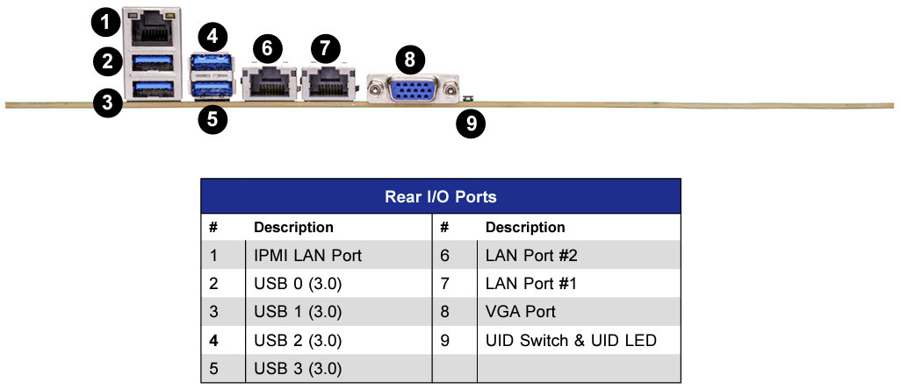
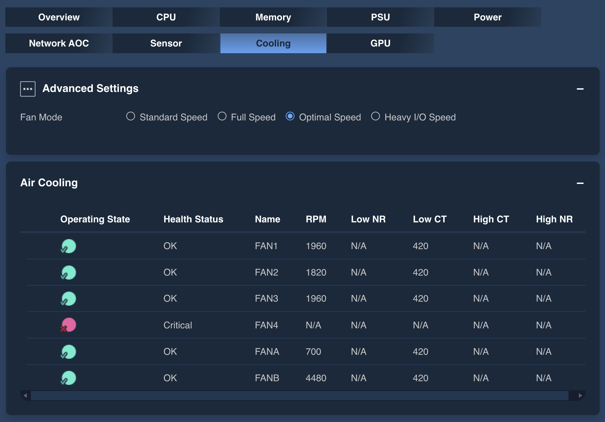
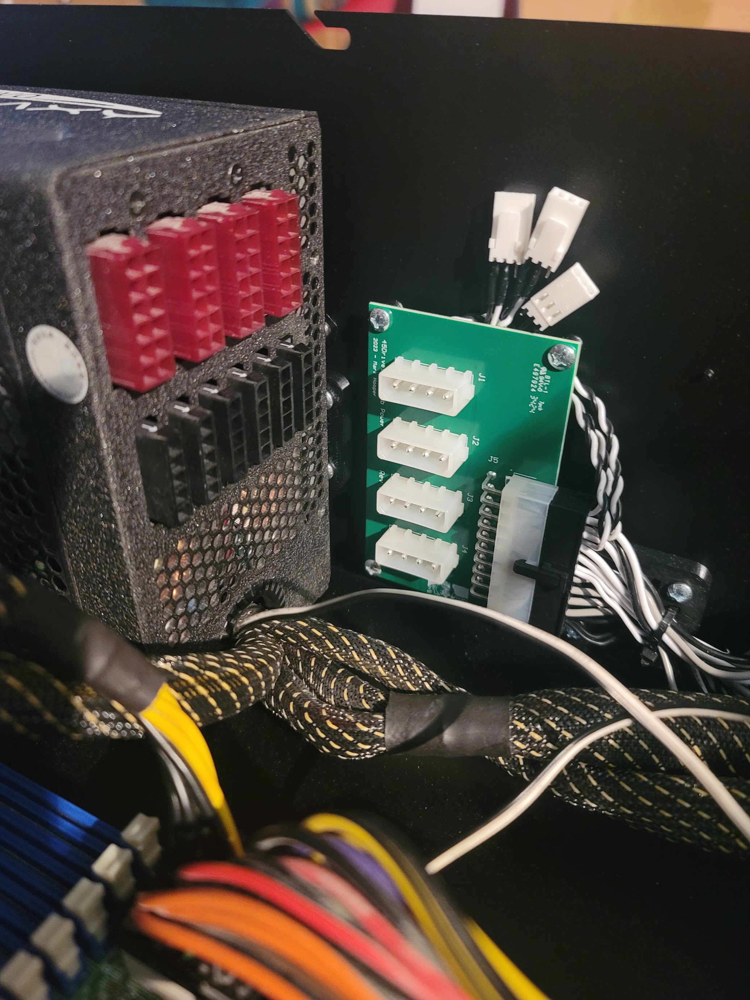
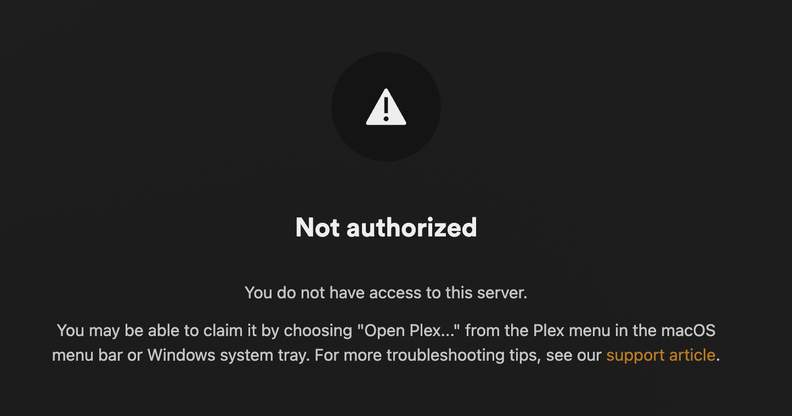

# home-lab
Home Laboratory

Where retired computer scientists and software engineers like to play....

<!-- TOC start (generated with https://github.com/derlin/bitdowntoc) -->

- [45 Drives Home Lab 15](#45-drives-home-lab-15)
   * [Bill of Materials](#bill-of-materials)
   * [Suppliers](#suppliers)
   * [Rationale](#rationale)
      + [AMD EPYC](#amd-epyc)
      + [Supermicro H13SSL-NT](#supermicro-h13ssl-nt)
      + [Software](#software)
      + [ZFS](#zfs)
   * [Details](#details)
      + [RAID](#raid)
      + [HL15](#hl15)
      + [H13SSL-NT](#h13ssl-nt)
- [Lessons Learned](#lessons-learned)
   * [HL15 Chassis](#hl15-chassis)
      + [Documentation](#documentation)
      + [PSU](#psu)
      + [Fans](#fans)
      + [Cables](#cables)
         - [DHL Extortion](#dhl-extortion)
      + [Disk Cages](#disk-cages)
   * [First Light](#first-light)
- [Slings and Arrows](#slings-and-arrows)
   * [Supermicro](#supermicro)

<!-- TOC end -->

# 45 Drives Home Lab 15

A project to build a home-lab server based on the 45 Drive HL15 chassis.

I thought of doing a video of this, as I did take a course from GIFT years ago, Gulf Islands Film and Television School,
and what I learned most was how much work it is, especially when you are solo. I have a lot of respect for people who do
this for a living. If I decide to do a video, this is the script...

## Bill of Materials

1. [45 Drives HL15](https://store.45homelab.com/configure/hl15)
   1. Black Faceplate
   1. Noctua Fans
1. [Supermicro H13SSL-NT](https://www.supermicro.com/en/products/motherboard/h13ssl-nt)
1. [Supermicro 4U Active CPU Heat Sink Socket SP5](https://store.supermicro.com/us_en/4u-active-amd-epyc-snk-p0084ap4.html)
1. [AMD 9015](https://www.amd.com/en/products/processors/server/epyc/9005-series/amd-epyc-9015.html)
1. [Corsair WS DDR5 ECC RDIMM 64GB (4 x 16GB) DDR5 DRAM 6400MT/s CL32 Memory Kit × 1](https://www.corsair.com/ca/en/p/memory/cma64gx5m4b6400c32/ws-ddr5-ecc-rdimm-64gb-4-x-16gb-ddr5-dram-6400mt-s-cl32-memory-kit-cma64gx5m4b6400c32)
1. [WD Black SN850X](https://www.westerndigital.com/en-in/products/internal-drives/wd-black-sn850x-nvme-ssd?sku=WDS800T2XHE)
1. [MCIO x8 74 Pin ( NVMe) to 2 X Mini SAS SFF-8643 Cable - 50 CM](https://www.microsatacables.com/mcio-x8-74pin-nvme-to-2x-sff-8643-nvme-50-cm)
1. [Enermax Evo Galaxy EGX1250WT](https://www.newegg.ca/enermax-sgalaxy-evo-egx1250ewt-1250w/p/N82E16817194046)
   1. Repurposed from another build
1. [JetKVM](https://www.kickstarter.com/projects/jetkvm/jetkvm)
1. [Wera Kraftform Adjustable Torque Screwdriver with Quick-Release Chuck](https://www.kmstools.com/wera-kraftform-adjustable-torque-screwdriver-with-quick-release-chuck.html)
   1. Torx bit, t 20 x 152 mm
1. [TrueNAS](https://www.truenas.com)
1. [Plex](https://www.plex.tv/en-ca/personal-media-server)

## Suppliers

1. [45 Drives](https://45drives.com)
   1. HL15
1. [ATIC Computers](https://www.atic.ca)
   1. Supermicro H13SSL-NT
   1. Supermicro 4U Active CPU Heat Sink Socket SP5
   1. AMD 9015
1. [Corsair](https://www.corsair.com)
   1. Corsair WS DDR5 ECC RDIMM 64GB (4 x 16GB) DDR5 DRAM 6400MT/s CL32 Memory Kit
1. [Western Digital](https://www.westerndigital.com)
   1. WD Black SN850X
1. [Micro SATA Cables](https://www.microsatacables.com)
1. [KMS Tools](https://www.kmstools.com)
   1. WER-074710 Wera Kraftform Adjustable Torque Screwdriver with Quick-Release Chuck
   2. WER-050280 Wera Torx bit, t 20 x 152 mm

## Rationale

This is a summary, where I expand on these issues in additional sections.

I have been using a Dell Precision T3500 Since 2009. First this was a workstation I used while working at Kodak,
then later using it at home, where I added a Sans Digital 8 bay RAID system for archival, file, and media services.
I also use the SMB service for my Apple Time Machine backups, but this is difficult to configure. Hopefully,
TrueNAS will be able to handle this, via AFP. 🤞 

*As an aside, I have been using RAID systems&mdash;hardware and software&mdash;for over ten years now, and have been
burned many times. These days I am convinced that
[Software Defined Storage](https://www.supermicro.com/en/glossary/software-defined-storage)
(SDS) is the way to go, in particular with something like TrueNAS and ZFS. Albeit, this is my first time using it.*
*It is interesting to note that shortly after getting TrueNAS running, and coping most of my files from the Sans Digital
RAID system, the Sans Digital controller failed, and I was able to restore it to functionality.* Windows 10 is still
running, but it is futile to try to recover any data from the RAID.

This system also hosts my two printers, an HP LaserJest 1018 and a Kodak Hero 9.1. I cannot get these to run on
modern MacOS or Windows systems, but there is some hope TrueNAS may have support for the HP printer. The Kodak
printer is quite the beast, and is increasingly unreliable, so that will be a write-off.

After all this time, the Dell is still running Windows 10, where I cannot upgrade to Windows 11. Also, when rebooting,
I have to manually intervene because the system battery is low, which has become troublesome, and worrying. Normally
I run this system headless, and access it via Remote Desktop, but I have to be there to press F1 to continue booting.
The goal is to decommission this system before Windows 10 goes out of support in 2025.

After watching a lot of YouTube videos, and doing other research, I was sold on the 45 Drives products because so
many people testified to the quality/versatility. Initially I thought I would go with the HL15, but considered the
[45drives.com](https://45drives.com) AV15 with the AMD motherboard. However, this turned out to be too pricey for my tastes,
especially for customization. Also, the Storinator people really dropped the ball on presales support.

Going back to [45homelab.com](https://45homelab.com) I decided to just build it myself, and the presales support has
been much better. I have built systems before, and while I prefer not to, I was confident I could do it.

Briefly, I considered trying to run
[TrueNAS Scale on ARM](https://forums.truenas.com/t/truenas-scale-on-arm-2024-thread/2706/2)
system, but I have no idea when TrueNAS will ever support ARM.

### AMD EPYC

This is a server CPU, and I am building a Home Lab Server.

The EPYC line is particularly attractive because it has a lot of cores, a lot of memory channels, and a lot of PCIe
lanes. This is particularly attractive for a NAS because it can handle a lot of drives, a lot of memory,
and a lot of I/O. While the EPYC 9015 is a low-end CPU, but it is still a beast, and I can always upgrade later.

The EPYC 9015 has 16 cores, 32 threads, and 32 MB of L3 cache, where the 9965 has 192 cores, 384 threads,
and 384 MB of L3 cache.

The EPYC 9015 has a TDP of 150 watts, and the 9965 has a TDP of 280 watts.

The EPYC 9005 series has 12 memory channels, supports DDR5 memory, and PCIe 5.0.

### Supermicro H13SSL-NT

While I looked at a lot of different system boards, ultimately I decided I wanted a server board, and it had to be an
ATX form factor for the HL15. I also decided to go with the latest AMD EPYC technology, starting with a low end 9015.
If I decided I want more power, I can always upgrade the CPU, and many other components too.

This board has impressive upgrade potential, where I can upgrade the CPU, memory, storage, and PCIe cards. The EPYC
9965 has 192 cores, 384 threads, and 384 MB of L3 cache, were the 9015 has 16 cores, 32 threads, and 32 MB of L3 cache.

The H13SSL-NT has 12 DIMM slots, but I will only use 4 DIMMs to start with, and upgrade later when I have the money.
The 9015 has 12 memory channels, but it can run with as few as two. While this can handle up to 4.5 Terabytes
of RAM, I will likely not go above 192 Gigabytes as larger DIMMs are slower and have more latency.

The H13SSL-NT has two M.2 slots, and I decided to go with the WD Black SN850X with 8 TB so the wear leveling has the
most chance to preserve reliable storage, while also being high performance. I may find some Optane memory for the
second M.2 for ZFS write log if I feel I need better write performance.

The H13SSL-NT uses MCIO connectors for SATA, but unfortunately, 45 Drive do not stock cables for this.

While the H13SSL-NT supports remote management, I decided to get a JetKVM just in case... In particular, for first
configuration, you need to get in to the console to configure the remote management first. Also, if for any reason
the remote management is not working, the KVM is the most basic way to manage the server board.

### Software

My plan is to use TrueNAS and ZFS because my primary use will be as a media server, using Plex running under Docker.
Also, I will be serving both Apple File Service and Windows File Service (samba).

As a seasoned computer scientist and software engineer, who started programming in 1970, I like to do what I call
'recreational programming.' Now that I am retired, I would like to continue to play with technology, but not in a
mission critical way. TrueNAS has recently given up on Kubernetes, relying on Docker instead, and this makes me happy,
as there is little I find 'recreational' about Kubernetes.

### ZFS

One of the nicest new features of TrueNAS Electric Eel is that you can now add drives to a ZFS vdev, one drive at
a time, and the system will resilver it over time. This means I can start with fewer than 15 drives, and add more
when I need more storage.

## Details

If you have any questions or comments, please use GitHub Issues, and I will try to update this documentation.

### RAID

The main problem with most RAID solutions is that you get tied to proprietary implementations which is very
constraining.

Certainly this was the case with my Sans Digital hardware RAID controller. Recently I tried adding brand new
Western Digital Red 8 TB drives, but the RAID controller failed the drives shortly after accepting them, for no
obvious reason. Western Digital was happy to RMA the drive, but even the replacement failed.

When I contacted Sans Digital, after a while, looking at the RAID logs, he concluded that the WD Red drives are
not suitable for their controller because they are NAS drives, not Enterprise drives. While I had been using the
Red drives for many years, the newer 8 TB drives had more latency, so the Sans Digital controller just failed them
without explanation. ***Sans Digital have no empathy or compassion for their customers, and clearly their software
developer are lazy morons!***

I leaned the hard way that RAID-5 is not good enough, where after replacing a failed drive, if you get another failed
drive while rebuilding the array, the whole array is now a brick.

Even with RAID-6 I have been burned, where I had multiple drives fail, and the array became a brick during rebuilding.
This was a consequence of letting dust build up in the chassis, the drives overheating, where multiple drives
became unreliable at the same time. While the Sans Digital controller was able to warn me of the first drive failure,
the system beeper is insanely loud, so I disabled it, While it is possible to get email alerts, this is insanely
difficult to configure, even for someone with an MsC in Computer Science.

Now I am planning on using ZFS RAID-Z with three parity drives because I am that paranoid.

Another problem I had was the power supply failed. I was able to purchase a replacement from eBay, but it was partially
defective, so I had to power all the drives from one side of the power supply. This is not an ideal solution, but it
seems to be working. Another problem is the poor quality of the door on the front of the chassis, where it keeps
falling off, and I have to use tape to keep it on, where I damaged the connectors to the faceplate LEDs trying to
close the door. Everything still works, but it is a bit of a mess. 🤞

From the beginning, the CPU in on the Sans Digital controller was always running hot, while the Xeon in the Dell
does not complain, and they are both in the same chassis. I regularly get warnings from the Sans Digital controller
of CPU overheating.

An attractive feature of the HL15 is that it has a lot of fans, and they are Noctua fans, which are known for being
quiet and reliable. I am hoping this will be a big improvement over the Sans Digital chassis.

On my Dell T3500 I run RAID-0 from the system board so I can boot from it. Initially I used 15000 RPM disks, without
problems, but then replaced these with SSDs, and still have had no problems. 🤞 Still, I live in fear, even though this
is backed up daily. This is something I expect to fail, but I am okay with losing data that is younger than 24 hours
old.

### HL15

The largest RAID system I have ever run is eight disks, so I am hoping to eventually run with fifteen or more drives.
While I could probably squeeze one more disk in the HL15, because the H13SSL-NT supports that, it is probably more
trouble than it's worth.

### H13SSL-NT

The H13SSL-N has two 1 Gigabit ethernet ports while the H13SSL-NT has two 10 Gigabit ports, and that is the only difference.

With 12 RDIMM slots, this board can handle up to 4.5 Terabytes of RAM, but I will probably not go above 192 Gigabytes as
larger DIMMs are slower and have more latency.

[Supermicro Intelligent Management](https://www.supermicro.com/en/solutions/management-software/bmc-resources) offers
state-of-the-art management via [IPMI](https://en.wikipedia.org/wiki/Intelligent_Platform_Management_Interface) 2.0.
Before you can use it, you have to configure it in the UEFI, such as the IP address, then after that, via the 1 GB
ethernet port, you can access it from any web browser.

This is handy because I want to run my NAS headless. However, the JetKVM will be my backup, where I can access the VGA
and USB ports on the H13SSL-NT if there are any problems with IPMI. I need a VGA to mini-HDMI cable, and a USB-A to
USB-C cable.

# Lessons Learned

We learn more from our mistakes than our successes, so I hope people can learn from my mistakes.

## Acquisition

Ordering the system board from ATIC Computers was great as they also got me the CPU and CPU cooler. I got a break on
the CPU because it was from a tray, and not in a box. While I initially gave them the BOM for my project, they
declined the other things. Located in Vancouver where I lived, it was easy to pick everything up.

## HL15 Chassis

> [!TIP]
> If you have ordered the HL15 without a system board, it is strongly recommended you remove the fans and disk cage
> first, as this will greatly aid in reverse engineering the chassis, to make up for the lack of documentation.

1. First remove the fans from the front of the chassis.
   1. This is easy, just remove the screws, and unplug the fans.
1. Remove the second fan cage inside the chassis.
   1. This is easy, just remove the screws, and unplug the fans.
1. Remove the disk cage.
   1. This is easy, just remove the screws.
1. Before installing the system board, install the backplate for the system board I/O connections.
   1. IMHO, to not be able to install this after the system board is installed is a design flaw.
1. After installing the system board, do all the cabling, then install the disk cage, then the second fan cage,
   then the front fan cage.
   1. This can be a little tricky, as the power cables are short, and it's important to install things in
      the right order.

### Documentation

The HL15 comes with paper with a QR code that takes you to https://45homelab.com/gettingstarted/hl15,
but I did not find this terribly helpful. In particular, the
[HL15 User Manual](https://45homelab.com/pdf/45HomeLab-User%20Manual.pdf)
assumes you have a fully built system, and does not address many of the needs of someone building a system from scratch.
Sever times I have suggested to 45Drives they should contract me to write better documentation, but they have been very
***snotty*** about it.

> [!NOTE]  
> To be fair, dealing with the people responsible for the
> [Storinator AV15](https://www.45drives.com/products/storinator-av15-configurations.php)
> was very disappointing, while I have no serious complaints about the HL15 people.

After unpacking the HL15 I was impressed with the quality of the chassis, but realized I had a lot of reverse
engineering to do. I installed the Supermicro H13SSL-NT without too much trouble, but in retrospect this would have
been easier if I removed the fans and disk cage first. They are easy to remove, and doing this greatly aids in
reverse engineering the chassis, as well as making it easier to install and connect the system board.

### System Board

> [!TIP]
> Use the camera in your phone to take pictures of the system board before you install it, and after you install it.
> Also, at First Light (see below) take videos of everything.

My eyesight is not what it used to be, and I have a hard time reading the system board tiny labels, so I took a lot of
pictures with the 5X zoom on my phone. On the other hand, the main camera is the highest resolution, so you can always
digitally zoom afterward.

#### Documentation

I have a Rev 2.0 board, but User Manual is for a Rev 1.0b board. This is another good reason to take lots of pictures
and videos, because not everything is the same, and photos and videos keep one sane.

#### BMC

The default user is "ADMIN", and the password is on the system board near the serial number, and is also printed
on the CPU cover. Supermicro could have done a better job of documenting this, as there is a "Unique Password" on
the shipping box in large lettering, but this is not the BMC password.

Using the BMC is really nice, once you get in. Sadly, you need use a VGA monitor to find out what the IP address is,
or otherwise set it. There may be a way to discover the IP address, but I have not found it yet.

#### M.2 NVME SSD

Initially the BIOS could not see this, even thought the various LEDs suggested this was fine. I had to create
a support ticket with Supermicro.

#### SATA Cables

SATA 0 - 7 is the MCIO connector, SATA 8 - 11 is the vertical connector, and SATA 12 - 13 is the horizontal.

I love the MCIO to Mini SAS cable, and was able to route this via the HL15 cable management system. This would be
a much better system with one more MCIO SATA connector.

I had to change jumper ... because with the default jumper setting, the BIOS could not see the SATA drives.

I thought the horizontal SATA connectors might be a problem, but they are not, they slip under the inner fan case
nicely, but they are not optimal for the default SATA cable routing. C'est la vie.

### PSU

I deliberately ordered my HL15 without a PSU because I had a 1250 Watt Enermax PSU that I wanted to reuse.

[Enermax Galaxy EVO 1,250W Power Supply Review](https://pcper.com/2009/08/enermax-galaxy-evo-1250w-power-supply-review)
is a great review of this product, and given the expandability options of the HL15 and the H13SSL-NT, there is ample
power delivery for all the components I plan to use.

- Originally I had this on a 208 volt residential circuit, and this is slightly more efficient.
- While 110 volts works fine, putting it on a standard 15 amp circuit can be problematic.
- My plan is to put the HL15 on a 208 volt, 30 amp circuit, but I have not yet done this.
  - There is a residential clothes drier circuit nearby I hope to repurpose.
  - A common problem is that if I vacuum the living room, the vacuum cleaner trips the breaker, and all my computers
    go down.

In retrospect, this PSU is too much for this chassis as the cables take up too much space. Some of the cables are
hardwired, and the cables for a high-end graphics card are not needed, for now, but cannot be detached. Basically,
sticking a high-end workstation PSU in a server chassis is not a good idea.

### Fans

Dealing with fans with the Supermicro H13SSL-NT was a bit of a pain and let to a lot of surprises, that led to
a lot of frustration, a lot of learning, and a lot of support with Supermicro.

I plan to have the HL15 in the living room, so I wanted it to be as quiet as possible. After powering up the
system for the first time, I was surprised at how quiet it was with six Noctua fans. The PSU has an even larger
fan, but it is also silent. The fan on the CPU cooler was initially silent, but under certain conditions, can
be kinda noisy, but maybe not too bad after putting the cover back on the chassis.

- The HL15 comes with the six Noctua fans pre-installed
- These are all connected to the Noctua
  [NA-FH1 eight channel PWM fan hub](https://noctua.at/en/noctua-presents-na-fh1-eight-channel-pwm-fan-hub),
  which is connected to the system board through a single cable
  - The three front fans are connected directly to the hub
  - The three internal fans are connected to the hub through a splitter cable
  - According to Supermicro this is problematic because the hub draws a lot of current, and the system board
    may not be able to handle it through one fan header
  - However, the hub can also be powered via a SATA power connector
- The N13SSL-NT has six fan headers, FAN1, FAN2, FAN3, FAN4, FANA, and FANB
  - These are divided into two groups
  - On the advice of Supermicro, I connected the CPU and PSU fans to FANA and FANB to separate them from the
    Noctua fans. This seems stable, as the fans have stopped cycling up and down, and the system is running cool.
  - The H13SSL-NT is still unhappy with the fan hub.
  - The CPU cooler fan could run at 2000 RPM and still be cool, but it runs at 4480 RPM, and is noisy.
- I tried playing with Fan Mode in the BMC, but this did not seem to make any difference in the end.

In the end, the system is not as quiet as I would like because the CPU cooler fan runs much faster than it needs
to be, and there seems to be no way to control the fan speed. Everything runs cool, so the fans do not need to run
as fast as they are.

### Cables

The HL15 comes with the SATA cables pre-installed, but I could not order the configuration I wanted as 45Drives does
not stock the MCIO cables I need for the H13SSL-NT.

I am impressed how professionally the SATA cables are installed, but I had to undo this for various reasons.

1. The H13SSL-NT has one MCIO connector that supports 8 SATA drives.
   1. This is vertically mounted, and very convenient.
   2. While there are two more MCIO connectors, they cannot be used for SATA.
2. The H13SSL-NT has four horizontal SATA connectors that support 4 SATA drives, which is not optimal for the
   default SATA cable routing.
3. The H13SSL-NT has two vertical SATA connectors that are no problem at all.

#### DHL Extortion

| :warning: WARNING                                                                         |
|:------------------------------------------------------------------------------------------|
| DHL and other shipping companies are extorting money from customers for customs clearance.|

When I ordered cables from Micro SATA Cables, they used DHL, and DHL wanted to charge me extra for customs clearance.
I consider this extortion, and a criminal racket. I contacted Micro SATA Cables, and they said they get DHL to
ship without charging me extra, but it took over a week to get the package after it arrived in Canada.

They were actually very understanding of my position, and thanked me for the feedback.

The problem was that because of the Canadian Postal Strike, they could not ship with USPS, and they had to use DHL.
I told them I was in no hurry, would have been happy to wait. I also told them that companies should be advocates
for their customers, and not shills for the corrupt shipping industry.

DHL have cause me problems in the past, where they don't knock on the door, and just leave a note, for me to pick
up the package at their depot, but it takes days to get there. When I complained, they did not care, and claimed
I was not home, despite me telling them I was home all day.

### Disk Cages

> [!IMPORTANT]  
> One unfortunate design detail of the HL15 is that the power delivery has a bank of four 4-pin Molex connectors, 
> but the standard Molex 5-pin PSU cable only has three 4-pin connectors. However, the standard for SATA devices is a 
> 5-pin Molex with four SATA connectors.

I am not an electrical engineer, so cannot criticize this design, but it is a bit of a pain. I could imagine that
powering 15 drives from four SATA connectors could be a problem, and this is why they use Molex connectors. Perhaps
powering 15 drives from a single 5-pin Molex connector could be a problem, but my PSU has six 5-pin Molex connectors,
and four 12-pin connectors.

Unfortunately, I only had one 5-pin Molex to three 4-pin Molex cables, so I had to get another.

### RAM

The first time I powered on the system, the BIOS setup only reported 48 GB of RAM, but after reseating the DIMMs,
it reported 0 GB, and still does.

However, the BMC could see the RAM, and the system booted fine, so I am not sure what is going on.

I opened up a support ticket with Supermicro, but they were not very helpful.

While the RAM is rated at 6400 MT/s, the system board only supports 6000 MT/s. I am hoping that a future BIOS update
might fix this, but I am not holding my breath.

### M.2 NVMe SSD

Initially, neither the BIOS nor BMC could not see this, even though the various LEDs suggested this was fine.
The H13SSL-NT User Manual is out of date with respect to the M.2 LEDs.

However, the TrueNAS installer could see it, so I installed TrueNAS on it, and it worked fine. Now the BIOS can see it,
but the BMC still cannot see it. Also, while the BIOS can see the SATA drives, the BMC cannot see them. Apparently,
you have to get a license to use the BMC storage features, but I have not yet done this.

I had to create a support ticket with Supermicro, but their help was disappointing.

### TrueNAS Scale

[Downloading](https://www.truenas.com/download-truenas-scale) and Installing TrueNAS Scale was fairly straightforward,
but burning the ISO to a USB stick was a bit of a pain. Initially I tried using the Macintosh Disk Utility,
but it was a horror story because the UI/UX is so bad. As someone who taught UI design in a third year university
course, I am appalled.

In the end, it was easier to use the
[Macintosh command line utilities.](https://recoverit.wondershare.com/mac-tips/iso-to-usb-on-mac.html)
While there are many 'burning' utilities, the Macintosh command line is fairly simple to use.

    diskutil list
    diskutil unmountDisk /dev/disk4
    sudo dd if=~/Downloads/TrueNAS-SCALE-22.02-RC1.iso of=/dev/disk4 bs=1m
    eject /dev/disk4

Where my USB showed up as 'disk4'

After burning TrueNAS onto the USB drive, I simply booted from it.

Much to my surprise, the TrueNAS installer could see the M.2 NVMe SSD, and I was able to install TrueNAS on it.
More to my surprise, the BIOS was automatically configured to boot from the M.2 drive.

Personally, TrueNAS Scale running on an HL15 is a dream come true. The first thing I did was to test as many disks
as I could, and TrueNAS makes this very easy.

> [!WARNING]
> Running the 'long' test on a disk can take a long time. It took over 14 hours for an 8 TB disk.

Running the 'short' test only takes a few minutes on an 8 TB disk.

A few of the 4TB disks I had seemed in bad shape, so I pulled them from the system. These were drives I had been
using in my Sans Digital RAID system, and had failed, but I thought I would give them another try because the
Sans Digital controller is very picky.

Some of the 2 TB drives seemed kinda sketchy, but after retesting, they seemed to pass, so I am using them now.

#### VDEV Expansion

One of the nicest new features of TrueNAS Electric Eel is that you can now add drives to a ZFS VDEV, one drive at
a time. While this was harder to do than I imagined, it worked fine, and the system is resilvering the new drive,
however, it does take a while.

It was interesting to note that I had the server plugged into my power meter, and this process adds an additional
10 Watts to the system load, likely because this process is CPU intensive.

Another nice lesson was that you can move drives around in the HL15, and TrueNAS/ZFS will figure it out.

I create a ZFS3 VDEV with three parity drives, and a total of five drives, so adding a sixth drive was nice.

The problems I had are with the UI/UX, and the documentation. The UI/UX is very confusing, and the documentation
does not help, but the video ... was very helpful.

### Plex

There is 'software' and then there is 'shitware' and Plex is shitware. I will discuss this more in Slings and Arrows.

Installing Plex under TrueNAS Scale is simple, but configuring it was a nightmare.

TrueNAS Core uses Kubernetes, but TrueNAS Scale uses Docker, and this is a big improvement.

Initially, I could not login to Plex, and this was a nightmare. See below. However, eventually I realized that
originally I was accessing TrueNAS via 169.254.3.1, but then I realized I could access it via 10.0.0.176, and
going in via 10.0.0.176 I was able to login to Plex.

Trying to get Plex to 'see' my TrueNAS 'media' dataset was a nightmare. The video
[TrueNAS Scale: Plex Dataset Permissions](https://www.youtube.com/watch?v=NmTGciOs3GU)
gave me the most insight, but was not enough to solve the problem.

While I have decades of System Administration experience, I hate doing it because in the SysAdmin culture,
if it's not hard, you're not doing it right.

## First Light

Powering up any system for the first time was a bit of a nail-biter. Things started, but there were problems.

1. Before powering on
   1. I plugged the PSU into the wall
   2. I plugged a monitor into the VGA port, and powered it on
   1. I plugged a USB keyboard and mouse into the USB port
      1. Technically this is not necessary if the BMC works properly... 
   1. I plugged the BMC ethernet into my ethernet switch
1. I powered PSU via the external switch
   1. The BMC Heartbeat LED on the system board started flashing
      1. Fast while initializing
      1. Slow after initialization
   1. The M.2 Error LED (LED9) was solid green
      1. Supposedly this means the M.2 drive is detected, but according to the user manual, it should be off, so
         I am not sure what this means, other than the user manual is out of date.
   1. The LED on the M.2 drive was flashing white, eventually...
1. Surprisingly, the chassis power switch was flashing, but would not start up the system until it stopped flashing.
   1. This was a confusing time as nothing happened for a bit, and I was not sure what was going on.
   1. After the chassis power switch went dark, I pressed the power button, and the system started up, the fans
      started spinning, and the CPU cooler fan started spinning. The monitor woke up, and I saw the Supermicro logo.
   1. There was a message that it would take a few minutes to boot, it about 2.5 minutes the first few times.
1. After the BMC finishes initializing, it displays the BMC network addresses at the bottom of the screen
   1. IP V4
   1. IP V6
   1. After this, you can type one of these addresses into a web browser and connect to the BMC
      1. Sadly, I could not login because it would not accept the user/password credentials
      2. While the default user is supposed to be "ADMIN", the password is printed on the shipping box, but
         it did not work, so I had to create a support ticket with Supermicro
      3. Eventually, after sleuthing through more documentation, I found that the password is on the system
         board near the serial number, and is also printed on CPU cover, and this worked, so I closed the
         support case with Supermincro
1. After seeing the BMC addresses and other information, the system boots into the UEFI,
   unless you press the delete key on the keyboard, then it drops you into setup
   1. I did not spend much time in the UEFI, as it's been a long time since I used an EFI
   1. I spent a fair bit of time poking around in setup, setting the date and time, inspecting other settings.

The first time I powered up the system, setup only reported 48 GB of RAM, but after reseating the DIMMs, it reported
0 GB, so that was rather distressing. I could not get it to see the RAM again after that.

Eventually I put the who system on a power meter, and under normal load with TrueNAS running, it uses about 200 watts,

# Slings and Arrows

Some people may find this hard to believe, but working with technology can be very frustrating, and especially
computer technology.

I started programming computers in 1970, got a BSc. in Computer Science in 1981, and an MSc. in Computer Science
in 1995, and I have been working as a software engineer since 1979, so I have a lot of experience with computers.
The most important thing I have learned is that the movie [Idiocracy](https://en.wikipedia.org/wiki/Idiocracy)
is not a comedy, it is a documentary on where we are headed, largely because of computer technology.

## Supermicro

While they seem to have good products, their ability to design and build functional websites is very poor.

1. I created an account on the support website without problem. But when I tried to create the same account
   on the sales website, it would not let me because it has different rules for passwords, overly restrictive
   rules.
2. When I tried to purchase a BMC license SFT-DCMS-SINGLE, I had nothing but problems.
   1. Website navigation is poor, I could not navigate to the product page.
   2. Fortunately, the search function worked, and I was able to find the product page.
   3. However, you cannot purchase the product without selecting the system board, and the H13SSL-NT is not listed.
   4. I had to use the support chat, who told me to use a different model. This worked.
   5. At checkout, I could not pay for the product without creating an account. See first problem above.
   6. After creating an account, it wanted to verify by sending me email.
      1. I did not receive the email.
      2. It told me to check my junk mail, but it was not there.
      3. I tried giving feedback on their website. Turnaround is about a day based on previous experience.
      4. I tried phoning for support, waited on hold for 20 minutes, then the phone menu system asked me to
         leave a message.

## Plex

***Plex is a shit-show.*** Well, trying to run the Web UI under TrueNAS Scale at least.

After installing and running Plex, then clicking the Web UI button in the TrueNAS UI I got

This is a terrible user experience! It's a common error, with no reasonable advice on the internet of how to fix the
problem.

In the end, the problem was I was initially accessing TrueNAS via 169.254.3.1 on my local network, because that is
how things just started up. Later I realize I come in via 10.0.0.176, and from here the Plex web UI just worked.

I am also pretty sure that whoever designed the UI/UX for Plex is not from planet earth. They are so tangled up in
'conversion' that they have lost sight of a good user experience.

> UX conversion nightmares are situations where a website or app's user experience (UX) negatively impacts conversion
> rates. This can happen when a website is difficult to use, frustrating, or slow to load.
>
> -- Google AI

Actually, 'conversion' is a marketing term, and has nothing to do with a quality user experience, it is all about
exploiting the user. This is why I call Plex 'shitware.' Plex UX imposes a nasty 'External Locus of Control' on
the user.

> Locus of control is a person's belief about how much control they have over the events in their life.
> It's a key aspect of personality psychology.
>
> What is locus of control?
>
>    Internal locus of control: The belief that a person's actions determine the outcome of events
>    External locus of control: The belief that external forces, like luck or other people, determine the outcome of events
>
> Who developed the concept?
>
> Julian B. Rotter developed the concept of locus of control in the 1950s
> 
> -- Google AI

# Best Practices

These are my personal best practices, but certainly other will have different opinions.

## Measure Twice, Cut Once

Being HSP/SPS certainly help me a lot because I am very careful, and I like to plan things out in advance. Also,
I score rather high on the neurotic index of personality tests, so I worry a lot, too much.

In spite of the best laid plans of mice and men, always have Plan B, Plan C, etc.

Get advice from as many different sources as possible, but be prepared to ignore it all, and do what you think is best.
However, more people are saying the same thing, the more consideration it should be given.

## Photos and Videos

Take lots of photos and videos of everything, before, during, and after. This is not only for documentation, but
also for sanity. It is easy to forget things, and photos and videos can help you remember. Also, when making support
calls, or RMA requests, photos and videos can be very helpful.

## Server Culture

When building a Home Lab NAS Server, it is important to adopt a server culture. This is a culture of reliability,
maintainability, flexibility, etc. Sure, it's going to cost more, but sanity is worth a lot.

- The BMC, IPMI, KVM, etc. are all very important
- The HL15 is a superior server chassis, designed and implemented in a server culture
- Supermicro are experts at server boards, designed and implemented in a server culture
  - I am really glad I went with a server board instead of a workstation board
  - Regrettably, I went with a workstation PSU, where the cables are too long because on the system board the
    power connectors right beside the PSU
  - On my previous workstation board, two of the power connectors are the furthest distance from the PSU
- The AMD EPYC 9005 series is a server CPU, designed and implemented in a server culture
  - Huge memory capacity with 12 memory channels
  - Huge number of PCIe 5.0 lanes

## TrueNAS

Administrator account: truenas_admin (default)